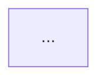

# System Architect

## Purpose

Turn a one-paragraph project idea into a real system design: the components **this
specific idea** requires, a mermaid flowchart showing how they connect and how data
moves between them, and one plain-English sentence per component that a
non-technical reader can follow. The result is saved to
`project-blueprint/architecture.md`.

This skill designs. It does not build, install, or run anything.

## When to use

- "How would this actually work as a system?"
- "Design the architecture for this idea."
- "Draw me a diagram of how this would fit together."
- The user describes a project and wants to know what pieces it needs.

**Do not use** for architecture review of code that already exists, for choosing
specific technologies (that is `/tech-stack-recommender`), or for deciding what to
build first (that is `/mvp-scoper`).

## Input

One paragraph from the user covering **who it's for**, **what it does**, and **the
one thing it must do well on day one**.

If the paragraph is missing the day-one sentence, ask for it before designing. That
sentence is what forces a real design decision instead of a generic three-tier
diagram — it is worth one round-trip to get.

If the user supplies only a fragment ("an app for dog walkers"), design from what
they gave you, state the gaps in Assumptions, and do not stall.

---

## Step 1 — Derive the components from the paragraph

**The rule: every component must trace back to specific words in the user's
paragraph, and every component those words imply must appear.**

A padded diagram is a worse answer than a small one. Do not emit a component
because architectures usually have one. Emit it because this idea needs it.

Work through each category and apply its test. The answer is often *no*.

| Category | Include only if | Skip when |
|---|---|---|
| **Frontend** | A human interacts with it directly | It is a scheduled job, a webhook, or an API other software calls |
| **Backend / API** | There is auth, more than one client, or logic that must not run in a browser | It is a single-user local script |
| **Database** | State outlives a single session | Every run is stateless and self-contained |
| **Object storage** | The idea handles files, images, documents, or audio | It only moves structured records |
| **Queue + worker** | Work is slow (seconds+), bursty, or must survive a crash | Everything finishes inside one request |
| **AI / agent layer** | The idea needs generation, extraction, ranking by meaning, or conversation | Rules, arithmetic, or a lookup would do the job |
| **External services** | The paragraph named or implied one — sign-in, payments, email, SMS, maps, a site being read | Nothing outside the system is touched |
| **Cache / search index** | Reads dominate, or the idea says "search" over lots of text | Volume is genuinely small |

Then apply the two rules that make a design specific rather than plausible:

1. **Name the guarantee component.** The day-one sentence outranks everything else.
   Some component exists specifically to guarantee it. Identify it and say so — it
   is the most important box on the diagram.
2. **Split any component doing two unrelated jobs.** If one box both talks to an
   external API *and* enforces business rules, that is two boxes.

**Forbidden output:** a Web App → API → Database triangle that would fit any idea
ever described. If your component list would not change when the user's paragraph
changes, you have not designed anything.

## Step 2 — Write one plain-English sentence per component

For each component write **one sentence** saying what it does *for this project*.

- Name what it accomplishes for the user, not what category of software it is.
- No jargon a career-services advisor, a shop owner, or a school principal would
  not use. No "orchestration layer", "persistence tier", "middleware".
- Reference the actual nouns from the user's idea — resumes, postings, students —
  not abstractions like "records" and "entities".

Test: read the sentence aloud to an imagined non-technical stakeholder. If they
would need a follow-up question to know what the thing is for, rewrite it.

> **Bad:** "Postgres — the relational persistence layer for application state."
> **Good:** "Postgres — remembers advisors, students, every report run and its
> result, and exactly what an advisor changed by hand afterward, so a student's
> history is still there next semester."

## Step 3 — Draw the mermaid flowchart

A genuine diagram of **this** system: every component from Step 1 appears, and every
arrow carries the data or action crossing it.

**Syntax rules — follow these or the diagram will not render:**

- Open with `flowchart TD`.
- Node shapes carry meaning, consistently:
  - `([Stadium])` — entry points, the humans or triggers that start things
  - `[Rectangle]` — services you build
  - `[(Cylinder)]` — data stores and queues
  - `{{Hexagon}}` — third parties you do not control
- **Every arrow is labelled** with what crosses it:
  `API -->|"writes run row, status queued"| DB`. An unlabelled arrow says two boxes
  are related without saying how, which is the thing the diagram exists to show.
- Readable labels. `DB` is not a label; `"Postgres — advisors, students, runs"` is.
- **Quote any label containing a comma, parenthesis, colon, or quote mark.**
- Never use a mermaid reserved word as a node ID — `end`, `graph`, `subgraph`,
  `class`, `style`, `click`, `o`, `x`. `End` and `END` break too. Use `Finish`.
- Group your own services in a `subgraph` so the trust boundary is visible; leave
  third parties outside it.
- Show the return paths, not just the forward ones. A flowchart with no arrow
  coming back is a wish, not a design.

Then re-read the block line by line and confirm it parses: every node referenced in
an arrow is declared, every `subgraph` has a matching `end`, every bracket and quote
closes.

## Step 4 — Save to `project-blueprint/architecture.md`

Create the directory if needed. Use exactly this structure:

````markdown
# <Project Name> — System Architecture

_Generated <YYYY-MM-DD>_

## The Idea
<the user's paragraph, verbatim>

## Components
| Component | What it does for this project |
|---|---|
| **<Name>** | <one plain-English sentence> |

## How It Fits Together


## Data Flow, Step by Step
1. **<What happens>** — <the movement of data, in plain English>

## Build Order
| Phase | Weeks | What lands | What it proves |
|---|---|---|---|

## Assumptions
- **<Assumption>** — <what changes if it is wrong>

## What This Design Does Not Cover
- <honest omission>
````

**Never overwrite silently.** If `project-blueprint/architecture.md` already exists,
read it first and tell the user what is being replaced.

## Step 5 — Self-check before reporting

Do not report done until all seven pass:

- [ ] Every component traces to specific words in the user's paragraph
- [ ] The guarantee component for the day-one promise is named
- [ ] Every component sentence is jargon-free and one sentence long
- [ ] Every mermaid arrow is labelled
- [ ] Every subgraph closes; every node in an arrow is declared; labels with commas
      or parentheses are quoted
- [ ] The design would look different if the paragraph were different
- [ ] Assumptions and non-coverage are honest, not decorative

## Report

State: the exact path written, the component list with one line on why the idea
required each, what you assumed, and the single question whose answer would most
change the design.

---

## Relationship to the locked cohort prompt

For classroom use, the self-contained student prompt is
[`docs/prompts/system-architect-student-prompt.md`](../../../docs/prompts/system-architect-student-prompt.md),
**locked at v1.0 (2026-08-06)**. It covers this same design work *plus* the
multi-page HTML knowledge base, and is deliberately paste-able on machines where
this skill is not installed.

This skill covers the Markdown deliverable only. The two must not disagree: the
component-derivation rules, the mermaid rules, and the `architecture.md` section
list here are the same ones the locked prompt specifies. If the prompt is version
bumped, update this file in the same change.

Reference output: [`project-blueprint/architecture.md`](../../../project-blueprint/architecture.md).
