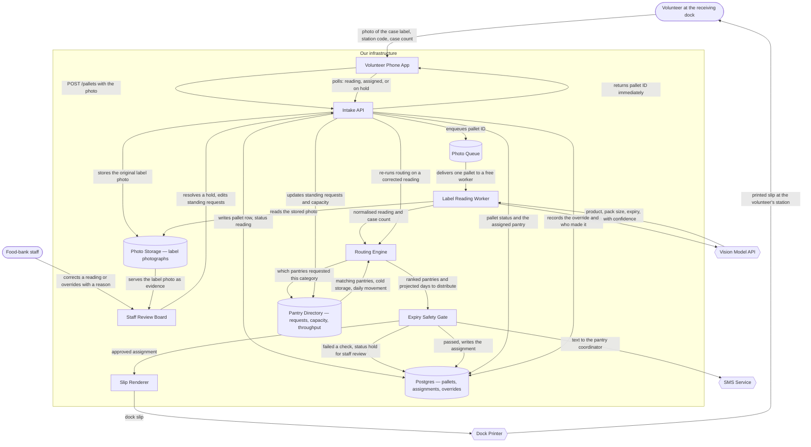

# Pantry Router — System Architecture

_Generated 2026-08-06_

## The Idea

It's for the two staff and rotating volunteers at a regional food bank who receive donated pallets all day and have to decide, on the spot, which of their 40 partner pantries each one goes to. A volunteer photographs the case label on their phone, and the system reads the product name, quantity, and expiry date off the photo, then matches it against what each pantry has asked for and how fast that pantry actually moves that kind of food, and prints a routing slip telling the volunteer which dock to stage it on. Coordinators at the receiving pantries get a text when a pallet is assigned to them, and every assignment stays on record so the food bank can show a funder where the donated food went. Photos come in bursts when a truck arrives — 60 labels in ten minutes, then nothing for an hour — and reading a label takes a few seconds, so the volunteer cannot be left waiting on a spinner. The one thing it must do well on day one: never route food to a pantry that cannot distribute it before it expires — if the expiry date is unreadable or the timing is too tight, it must say "hold for staff review" instead of guessing.

## Components

| Component | What it does for this project |
|---|---|
| **Volunteer Phone App** | The one screen a volunteer uses at the dock — photograph a case label, confirm the case count, and watch a short live list turn each pallet into a pantry name and a dock number, or a hold. |
| **Staff Review Board** | The desk screen where the two staff work through everything the system refused to route — the label photo beside the reading it got, which check failed, and a correct-or-override control that records who decided and why. |
| **Intake API** | Takes the photo off the phone, files it, writes down that a pallet arrived, puts it in line to be read, and hands the phone back an answer immediately so the volunteer can photograph the next case. |
| **Label Reading Worker** | Picks one waiting pallet at a time and turns a photograph of a case label into a product name, a pack size and an expiry date, each one carrying the text it actually read and how sure it is. |
| **Routing Engine** | Decides where the food goes by arithmetic, not by opinion — which pantries asked for this kind of food, whether they have the cold storage for it, how many days their own record says it takes them to move that quantity, and which of them can clear it soonest. |
| **Expiry Safety Gate** | The reason nothing rots on a pantry shelf: the last checkpoint before anything is assigned, printed or texted, which blocks the assignment whenever the expiry date is unreadable, is in the past, or leaves less time than that pantry needs to hand the food out — and sends the pallet to staff instead. |
| **Slip Renderer** | Turns an approved assignment into the small printed slip a volunteer carries with the pallet — pantry name, dock number, product, count and expiry date, big enough to read across a warehouse. |
| **Photo Queue** | The waiting line of label photos, so sixty cases photographed in ten minutes get read in the order they arrived instead of overwhelming the reader or making a volunteer stand still. |
| **Postgres** | Remembers every pallet that came in, what was read off its label, where it was sent, what a staffer overrode and why — which is what you query when a funder asks where the donated food went. |
| **Pantry Directory** | The maintained list of the 40 partner pantries: what each one has standing requests for, whether it has refrigeration, how much it can take at once, and how fast it has historically moved each kind of food — this is what routing decides *from*. |
| **Photo Storage** | Holds the label photographs themselves, both as the thing the reader works from and as the evidence a staffer looks at when they disagree with a reading. |
| **Vision Model API** | Reads the label in the photograph — the one job in this system that needs a model, because case labels are photographed at an angle, in bad light, with shrink wrap over them. |
| **SMS Service** | Sends the pantry coordinator the text that tells them a pallet is theirs, what it is, and when it has to be out the door by. |
| **Dock Printer** | The receipt printer at the volunteer's station that the routing slip comes out of — hardware nobody controls, which jams and runs out of paper in the middle of a truck. |

**The guarantee component is the Expiry Safety Gate.** The day-one sentence — *never route food to a pantry that cannot distribute it before it expires* — is not a property of the routing engine, because a ranking always returns a best answer even when the best answer is bad. The gate exists to be allowed to return nothing.

## How It Fits Together

## Data Flow, Step by Step

1. **A truck backs in and a volunteer opens the station link** — the phone screen is scoped to one dock by a station code, not to a named person, because the volunteers rotate.
2. **The volunteer photographs one case label and confirms the case count** — the photo is what the system reads; the count is the one number a human types, because it cannot be seen in the picture.
3. **The API answers before the work starts** — it files the photo, writes a pallet row marked *reading*, drops the pallet ID on the queue, and hands the phone back an ID straight away. The volunteer photographs the next case instead of watching a spinner.
4. **A worker takes one pallet off the queue** — bursts of sixty photos become an orderly line, and a photo that fails is retried rather than lost.
5. **The model reads the label, and only the label** — product name, pack size and expiry date come back as structured fields, each carrying the exact text the model read and a confidence score. That confidence is not decoration; the gate uses it later.
6. **The reading is normalised to a food category** — "GRN BEANS 6/#10" and "Green Beans, canned, No. 10" resolve to the same category in the directory, so the matching that follows compares like with like.
7. **The routing engine ranks pantries by arithmetic** — pantries with a standing request for that category, filtered by cold-storage need and how much they can take at once, scored on how many days their own record says they need to move that quantity. Every input to that score is a number a staffer can look up and argue with.
8. **The expiry safety gate has the last word** — the top-ranked pantry is accepted only if the expiry date parsed cleanly, is in the future, was read with high enough confidence, and leaves more days than transit plus projected distribution plus a fixed safety buffer. Any failure means no assignment, no print, no text: the pallet becomes *hold for staff review*.
9. **A pass turns into a slip, a record and a text** — the assignment is written, the dock slip prints at the volunteer's station, and the pantry coordinator gets a text saying what is coming and the date it has to be out the door by.
10. **A hold goes to the desk, and the override is the metric** — the staff screen shows the photo, the reading, and which check failed; a staffer corrects the reading and re-runs it, or overrides with a reason. Every override is stored, because the rate at which humans overrule the gate is the only honest measure of whether the gate is set correctly.

## Build Order

| Phase | Weeks | What lands | What it proves |
|---|---|---|---|
| **Read a label** | Weeks 1–3 | Photo capture on a phone, photo storage, vision extraction with confidence scores, the reading shown back on screen | That a model can read a real case label photographed at an angle under warehouse lighting. If it cannot, nothing after this matters — stop here. |
| **Never route past expiry** | Weeks 4–7 | Pantry directory and standing requests, the deterministic routing engine, the expiry safety gate, the staff review board for holds | That the day-one promise holds: every assignment clears the expiry math, and everything that does not clear it lands on a desk instead of a pallet. **This is the phase the idea lives or dies on.** |
| **A real truck** | Weeks 8–10 | Queue and workers for burst arrivals, dock slip printing, coordinator SMS, the live list on the phone | That sixty labels in ten minutes get through without a volunteer waiting on any single one. |
| **Trust and records** | Weeks 11–12 | Assignment history and funder export, override reasons and a gate-accuracy report, throughput figures updated from actual pickups | That the food bank can show a funder where the food went, and can tell whether the gate is set too tight or too loose. |

## Assumptions

- **One label represents the whole pallet.** The volunteer photographs one case and confirms how many cases are on the pallet. *If wrong:* mixed pallets need case-level scanning, which changes the phone app from one photo to a scanning session and roughly doubles the intake flow.
- **Pantry throughput is seeded by hand.** Coordinators' estimates of how fast they move each category are typed in at setup; the system does not learn them until phase 4. *If wrong:* the routing engine's central number is a guess for the first months, and the safety buffer is doing more work than the ranking is.
- **Volunteers are not individually identified.** A station code identifies the dock, not the person holding the phone. *If wrong:* you need volunteer accounts on day one, plus whatever policy covers minors and one-day volunteers.
- **Pickup is same-day or next-day, per pantry.** Transit enters the expiry math as a fixed allowance per pantry rather than a scheduled route. *If wrong:* routing has to consider the delivery calendar, and the gate's arithmetic gains a variable it does not have today.
- **Every assignment and override is kept indefinitely.** That record is what a funder audit reads and what the gate-accuracy report is built from. *If wrong:* the funder story is anecdotal and the gate can never be tuned with evidence.
- **The warehouse has working wifi.** There is no offline queue on the phone on day one. *If wrong:* intake stops when the connection does, which at a loading dock is a matter of when, not if.
- **One warehouse, one printer per dock.** *If wrong:* the slip renderer needs printer routing and a per-site directory, neither of which is designed here.

## What This Design Does Not Cover

- **Cold-chain compliance.** The design checks whether a pantry *has* refrigeration; it does not track temperature, log excursions, or prove the chain held. That is a regulated problem and it is not solved here.
- **Allergen, dietary and cultural restrictions** at the pantry level. Routing matches food categories, not the dietary needs of the people a specific pantry serves.
- **Recall handling.** If a lot number is recalled, nothing here traces which pantries received it. The photo and the reading are stored, so the data exists — the tracing path does not.
- **Damaged, dented or partially unusable cases.** The system assumes what arrives is distributable.
- **Non-English labels**, and a non-English volunteer interface. Both are likely needed sooner than they are comfortable to admit.
- **Offline operation** at the dock, per the assumption above.
- **A funder-facing export.** The assignment record is captured in a shape that can answer the question; no report surface is designed.
- **Scale past one warehouse.** A single database, a single queue, one worker pool — correct at this size, and openly not a multi-site design.
- **Whether a pantry can refuse a pallet.** This is the open question, and it is the one answer that would change the most: see below.

## The Open Question

**Can a pantry decline an assignment?**

As designed, an assignment is a decision — the gate approves it, the slip prints, the coordinator is told. If a pantry can say no, the assignment becomes an *offer*: it needs a timeout, two-way SMS, a re-routing loop, a second pass through the expiry gate on the new candidate (whose margin is now smaller, because time has passed), and a slip that cannot print until somebody accepts. That single answer rewrites roughly half of the diagram above.
